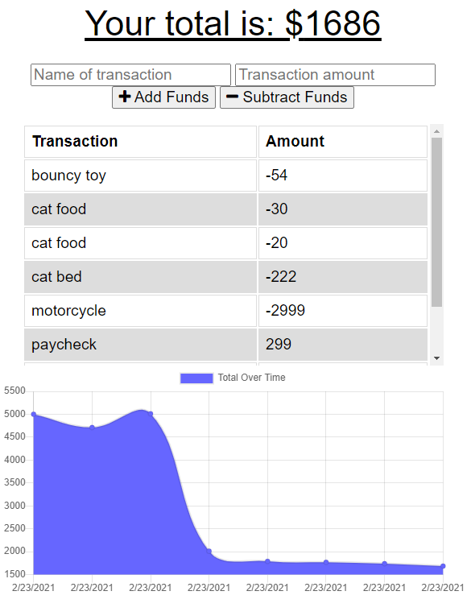

# Progressive-Budget
[](https://lbesson.mit-license.org/)

## Description



Progressive Budget is an app demonstrating service worker and indexedDB functionality to provide offline-service and caching of user requests.


## Table of Contents

* [Usage](#usage)
* [License](#license)
* [Contributing](#contributing)
* [Questions/Contact](#questions/contact)


## Usage

The site can either be downloaded and ran locally via ```node server.js```.


## License

[](https://lbesson.mit-license.org/)

This project is covered under the MIT.  Click the badge above to learn more.


## Contributing

To contribute to the project, send me a message on github.


## Questions/Contact

 http://github.com/emelanson

 My email is (my first and last name)@gmail.com


  